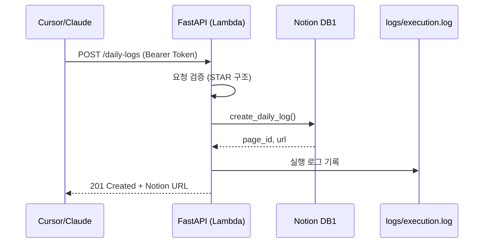
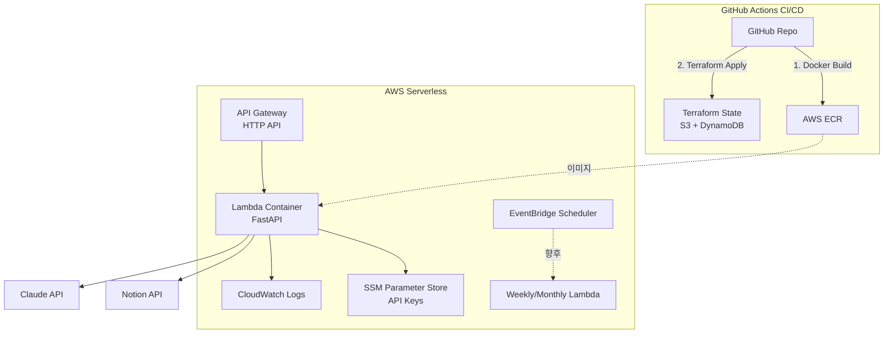

# 업무 자동 로깅 및 이력서 관리 시스템

회사 프로젝트에서 수행한 업무를 실시간으로 정리하고, 주간·월간 단위로 자동 요약해 이력서에 활용할 수 있도록 돕는 저장소입니다. 실제 개발 업무는 회사 환경에서 진행되며, 이 저장소는 **업무 기록 자동화 스크립트·REST API·인프라 정의를 관리**하는 목적으로 사용합니다.

## 목차

- [프로젝트 개요](#프로젝트-개요)
- [아키텍처](#아키텍처)
- [빠른 시작](#빠른-시작)
  - [사전 준비](#사전-준비)
  - [가상환경 및 의존성 설치](#가상환경venv-생성-및-의존성-설치)
  - [개발 환경 설정](#개발-환경-설정-코드-기여-시)
- [Notion 설정](#notion-통합-및-데이터베이스-설정)
- [환경 변수](#환경-변수-구성)
- [스크립트 실행](#스크립트-실행-가이드)
- [Docker 실행](#docker-실행)
- [REST API 명세](#rest-api-명세)
- [테스트](#테스트)
- [AWS 배포](#aws-배포)
- [운영 및 모니터링](#운영-및-모니터링)

## 프로젝트 개요

- 일간: Cursor/Claude 등 외부 도구가 REST API(`/daily-logs`)를 호출하거나, 사용자가 터미널에서 `/daily-organize` 플로우를 실행해 Notion `Daily Work Logs` DB에 기록
- 주간: 스케줄러가 지난 1주 데이터를 취합해 Claude로 핵심 성과를 뽑고 `Weekly Achievements` DB에 저장
- 월간: 주간 데이터 묶음을 활용해 월간 주요 성과를 정리하고 `Monthly Highlights` DB에 저장
- 모든 자동화 파이프라인은 Python 스크립트/REST API로 구성되며, 배포는 Docker 컨테이너 + Terraform(AWS) 기반으로 자동화

## 아키텍처

### 1. API 플로우 (일간 로그)



### 2. 주간/월간 자동화 플로우


### 3. AWS 인프라 구성



## 빠른 시작

### 사전 준비

1. Python 3.10 이상
2. Notion 워크스페이스 접근 권한
3. Anthropic Claude API 키
4. Terraform CLI 1.5 이상
5. Docker 24.x 이상 (FastAPI 서버 빌드/테스트용)

## 가상환경(venv) 생성 및 의존성 설치

모든 스크립트는 가상환경에서 실행하는 것을 권장합니다.

```bash
python3 -m venv venv
source venv/bin/activate           # Windows는 venv\\Scripts\\activate
pip install --upgrade pip
pip install -r requirements.txt
```

재실행 시에는 작업 디렉터리에서 `source venv/bin/activate`만 수행하면 됩니다. 자동화 스케줄러 서버에서도 동일한 방식으로 venv를 구성한 뒤 스크립트를 실행합니다.

### 개발 환경 설정 (코드 기여 시)

코드 기여 시 코드 품질 도구를 설정하여 일관된 코드 스타일을 유지합니다.

**개발 도구 설치 및 설정:**

```bash
# 가상환경 활성화 후 모든 의존성 설치 (개발 도구 포함)
source venv/bin/activate
pip install -r requirements.txt

# Pre-commit 훅 설치 (Git 커밋 전 자동 검사)
pre-commit install

# 전체 파일에 대해 수동 실행
pre-commit run --all-files
```

**포함된 도구 및 버전:**

| 도구       | 버전   | 용도                                                     |
| ---------- | ------ | -------------------------------------------------------- |
| Ruff       | 0.8.4  | 코드 포맷팅, 린팅, import 정렬 (Black보다 10-100배 빠름) |
| Mypy       | 1.13.0 | 정적 타입 체킹 (점진적 적용)                             |
| Pytest     | 8.3.3  | 테스트 프레임워크 및 커버리지 측정                       |
| Pre-commit | 4.0.1  | Git 훅 자동화                                            |

**설정 파일:**

- `pyproject.toml`: Ruff, Mypy, Pytest 설정
- `.pre-commit-config.yaml`: Pre-commit 훅 정의

**코드 포맷 규칙:**

- **라인 길이**: 100자
- **타겟 Python 버전**: 3.13+ (실제 3.14 사용 중)
- **Import 정렬**: isort 호환 (first-party: scripts, tests)
- **활성화된 검사**:
  - `E`, `W`: pycodestyle (PEP 8 스타일 가이드)
  - `F`: pyflakes (논리 에러 검사)
  - `I`: isort (import 정렬)
  - `B`: bugbear (버그 가능성 검사)
  - `C4`: comprehensions (리스트 컴프리헨션 최적화)
  - `UP`: pyupgrade (최신 Python 문법 사용)
- **무시된 규칙**:
  - `E501`: 라인 길이 (ruff format이 처리)
  - `B007`: 사용하지 않는 enumerate 인덱스 허용
  - `SIM108`: 삼항 연산자 강제 안 함 (가독성 우선)

**수동 실행:**

```bash
# 코드 포맷팅 및 린팅 (자동 수정)
ruff check --fix scripts/ tests/
ruff format scripts/ tests/

# 타입 체킹
mypy scripts/

# 테스트
pytest tests/ -v
```

Pre-commit이 설치되면 `git commit` 시 자동으로 검사가 실행되며, 문제 발견 시 커밋이 중단됩니다.

## Notion 통합 및 데이터베이스 설정

### 1. Notion 통합 생성

1. https://www.notion.so/my-integrations 접속 후 로그인
2. `+ New integration` 선택
   - Name: `Work Logging System`
   - Type: `Internal Integration`
3. 발급된 `Internal Integration Token`을 `NOTION_API_KEY`로 사용

### 2. Database 1: Daily Work Logs

1. 새 페이지를 만들고 제목을 `Daily Work Logs`로 지정
2. `/table` → `Table - Inline`으로 테이블 생성
3. 필수 속성
   - `Name` (기본, 텍스트)
   - `Logged Date` (Date)
   - `Category` (Select)
   - `Impact Level` (Select)
   - `Tech Stack` (Multi-select)
   - `Status` (Select: Logged, In Review, Published 등)
4. 통합 연결: 페이지 우측 상단 `⋯` → `Connections` → `Connect to` → `Work Logging System`
5. URL에서 데이터베이스 ID를 추출해 `NOTION_DB1_ID`로 저장 (하이픈 제거)

### 3. Database 2: Weekly Achievements

1. 페이지 제목을 `Weekly Achievements`로 지정하고 테이블 생성
2. 필수 속성
   - `Period Start` (Date)
   - `Period End` (Date)
   - `Bullet Points` (Text)
   - `Source Logs` (Relation → Daily Work Logs)
3. 통합 연결 후 ID를 `NOTION_DB2_ID`로 저장

### 4. Database 3: Monthly Highlights

1. 페이지 제목을 `Monthly Highlights`로 지정하고 테이블 생성
2. 필수 속성
   - `Year-Month` (Date)
   - `Summary` (Text)
   - `Source Weeks` (Relation → Weekly Achievements)
3. 통합 연결 후 ID를 `NOTION_DB3_ID`로 저장

## 환경 변수 구성

1. `config/notion.env.example`을 복사해 루트에 `.env` 생성
2. 다음 값을 채웁니다.
   - `NOTION_API_KEY`
   - `NOTION_DB1_ID`
   - `NOTION_DB2_ID`
   - `NOTION_DB3_ID`
   - `API_AUTH_TOKEN` (REST API 호출 시 사용할 Bearer 토큰)
3. Claude API 사용을 위한 `CLAUDE_API_KEY` 등 추가 키는 이후 `.env`에 확장
4. `.env`는 Git에 커밋하지 않도록 주의

## 스크립트 실행 가이드

### 1. 일간 수동 기록 (`scripts/daily_logger.py`)

```bash
source venv/bin/activate
python scripts/daily_logger.py
```

- 회사 프로젝트에서 하루 업무를 마무리한 뒤 이 스크립트를 실행해 로그를 입력
- CLI는 제목, 날짜, 카테고리, 영향도, 상태, 기술 스택, 정량 지표, 이슈 URL, 상세 컨텍스트를 순차적으로 수집
- 저장 완료 시 Notion 페이지 URL을 출력하므로, 필요 시 회사 위키나 슬랙에 공유 가능

### 1-1. 일간 REST API (`/daily-logs`)

- FastAPI 기반으로 구현되어 Docker 컨테이너 또는 AWS Lambda에서 실행
- Cursor/Claude가 자동으로 호출할 수 있도록 Bearer 토큰 인증을 지원
- 자세한 규격은 [REST API 명세](#rest-api-명세)를 참고하세요

### 2. 주간·월간 스크립트

- `scripts/weekly_processor.py`: 특정 기간(기본 7일) 로그를 모아 Claude로 요약 후 DB2에 저장
- `scripts/monthly_processor.py`: 주간 성과를 바탕으로 월간 하이라이트 생성
- 로컬 실행: `python scripts/weekly_processor.py --days 7` 또는 `python scripts/monthly_processor.py --month 2025-11`
- AWS 환경에서는 EventBridge Scheduler에 의해 자동 실행

## Docker 실행

로컬에서 REST API를 테스트하거나 개발용으로 실행할 때는 Docker를 사용하세요.

```bash
docker build -t work-logging-api:local .
docker run --env-file .env -p 8000:8000 work-logging-api:local
```

실행 후 `http://localhost:8000/health` 로 상태를 확인하고, `POST /daily-logs` 호출로 Notion 기록을 검증합니다.

## REST API 명세

### 인증

- 환경 변수 `API_AUTH_TOKEN`이 설정되어 있으면 `Authorization: Bearer <토큰>` 헤더 필수
- 토큰이 비어 있으면 인증 없이 호출 가능(개발용)

### 엔드포인트

| Method | Path          | 설명                                    |
| ------ | ------------- | --------------------------------------- |
| GET    | `/health`     | 헬스 체크                               |
| POST   | `/daily-logs` | 일일 업무 로그 생성 후 Notion DB에 저장 |

### 외부 협업자용 가이드

외부 팀원이나 다른 프로젝트에서 이 API를 활용할 때는 아래 템플릿과 작성 가이드를 참고하세요.

#### 필드별 작성 가이드

| 필드           | 타입                | 필수 여부 | 설명                                                                                |
| -------------- | ------------------- | --------- | ----------------------------------------------------------------------------------- |
| `title`        | string              | 필수      | 업무 내용을 한 줄로 요약 (예: "결제 API 성능 개선", "사용자 알림 기능 추가")        |
| `context`      | string              | 필수      | STAR 구조(Situation, Task, Action, Result)로 작성, 각 섹션은 `### 헤딩`으로 시작    |
| `category`     | string              | 필수      | 업무 유형: `신규기능`, `성능개선`, `버그픽스`, `리팩토링`, `문서화`, `기타` 중 선택 |
| `impact_level` | string              | 필수      | 영향도: `High`, `Medium`, `Low` 중 선택                                             |
| `tech_stack`   | array[string]       | 필수      | 사용한 기술 스택 목록 (예: `["Python", "FastAPI", "Docker"]`)                       |
| `logged_date`  | string (YYYY-MM-DD) | 선택      | 작업 날짜, 미입력 시 서버 현재 날짜 사용                                            |
| `status`       | string              | 선택      | 상태: `Logged`, `In Review`, `Published` 등 (기본값: `Logged`)                      |
| `metrics`      | string              | 선택      | 정량 지표 (예: "응답속도 300ms → 80ms 개선", "테스트 커버리지 85% 달성")            |
| `ticket_url`   | string              | 선택      | 관련 이슈 트래커 URL (Jira, GitHub Issue 등)                                        |

#### STAR 구조 작성 예시

`context` 필드는 다음 형식으로 작성합니다. 각 섹션은 **`### Situation`**, **`### Task`**, **`### Action`**, **`### Result`** 헤딩으로 명확히 구분하세요.

**템플릿:**

```
### Situation
(배경과 문제 상황을 설명)

### Task
(해결해야 할 과제나 목표)

### Action
(실제 수행한 작업, 불릿 포인트로 세부 내용 나열 가능)

### Result
(결과와 성과, 가능하면 정량 지표 포함)
```

**실제 작성 예:**

```
### Situation
사내 로그는 CLI 수동 입력만 제공돼 Notion 자동 기록·이력 관리가 지연되고 있었습니다.

### Task
Cursor/Claude와 연동되는 REST API를 Docker+AWS Lambda 환경에 배포해 실시간 자동화를 확립해야 했습니다.

### Action
- FastAPI `/daily-logs` 엔드포인트와 Bearer 인증 구현, Notion DB 속성 매핑 및 상세 오류 로깅
- Docker 이미지, GitHub Actions, Terraform(AWS Lambda+API Gateway)으로 최소 비용 인프라 구성
- weekly/monthly 파이프라인을 포함한 통합 테스트 10건 작성, README/운영 문서에 명세 기록

### Result
로컬 Docker 실행만으로 Notion 자동 기록이 가능해졌고, 테스트 10건 자동 실행으로 회귀 위험을 제거했으며, Lambda 기반으로 고정비 없이 운영할 수 있게 되었습니다.
```

#### 복사용 JSON 템플릿

```json
{
  "title": "<업무 내용을 한 줄로 요약>",
  "context": "### Situation\n<배경과 문제 상황>\n\n### Task\n<해결해야 할 과제>\n\n### Action\n<실제 수행한 작업>\n\n### Result\n<결과와 성과>",
  "category": "<신규기능|성능개선|버그픽스|리팩토링|문서화|기타>",
  "impact_level": "<High|Medium|Low>",
  "tech_stack": ["<기술1>", "<기술2>"],
  "logged_date": "YYYY-MM-DD",
  "status": "Logged",
  "metrics": "<정량 지표 (선택)>",
  "ticket_url": "<이슈 URL (선택)>"
}
```

#### 실제 요청 예시 (curl)

```bash
curl -X POST https://your-api-endpoint.com/daily-logs \
  -H "Content-Type: application/json" \
  -H "Authorization: Bearer YOUR_API_TOKEN" \
  -d '{
    "title": "REST API 기반 일간 로그 자동화 구축",
    "context": "### Situation\n사내 로그는 CLI 수동 입력만 제공돼 Notion 자동 기록·이력 관리가 지연되고 있었습니다.\n\n### Task\nCursor/Claude와 연동되는 REST API를 Docker+AWS Lambda 환경에 배포해 실시간 자동화를 확립해야 했습니다.\n\n### Action\n- FastAPI `/daily-logs` 엔드포인트와 Bearer 인증 구현, Notion DB 속성 매핑 및 상세 오류 로깅\n- Docker 이미지, GitHub Actions, Terraform(AWS Lambda+API Gateway)으로 최소 비용 인프라 구성\n- weekly/monthly 파이프라인을 포함한 통합 테스트 10건 작성, README/운영 문서에 명세 기록\n\n### Result\n로컬 Docker 실행만으로 Notion 자동 기록이 가능해졌고, 테스트 10건 자동 실행으로 회귀 위험을 제거했으며, Lambda 기반으로 고정비 없이 운영할 수 있게 되었습니다.",
    "category": "신규기능",
    "impact_level": "High",
    "tech_stack": ["Python", "FastAPI", "Docker", "AWS Lambda", "API Gateway", "Terraform", "GitHub Actions", "Anthropic Claude"],
    "logged_date": "2025-11-09",
    "status": "Logged",
    "metrics": "REST API 자동화 도입, 통합 테스트 10건 자동 실행, Notion 일간 로그 실시간 기록",
    "ticket_url": null
  }'
```

#### 성공 응답

```json
{
  "page_id": "xxxxxxxx-xxxx-xxxx-xxxx-xxxxxxxxxxxx",
  "url": "https://notion.so/xxxxxxxxxxxxxxxxxxxxxxxxxxxxxxxx"
}
```

#### 오류 코드

| 코드 | 설명                                         |
| ---- | -------------------------------------------- |
| 400  | 요청 본문 검증 실패 (예: 날짜 형식 오류)     |
| 401  | 인증 실패 (`Authorization` 헤더 누락/불일치) |
| 500  | Notion API 호출 실패 등 서버 오류            |

#### 주의 사항

- JSON 내부의 `\n`은 줄바꿈을 의미하므로, 실제 요청 시 이스케이프 처리가 필요합니다.
- `context` 필드는 반드시 문자열로 전송해야 하며, 배열이나 객체 형태는 허용되지 않습니다.
- `category`와 `impact_level`은 Notion DB에 정의된 Select 옵션과 일치해야 합니다.
- Swagger 문서는 서버 실행 후 `/docs` 엔드포인트에서 확인 가능합니다.

> **협업 팁:** 외부 팀원에게 이 가이드를 공유하면, Notion DB 구조나 내부 필드명을 모르더라도 템플릿을 채워서 요청을 보낼 수 있습니다. Cursor/Claude 등 LLM 도구에 이 템플릿을 제공하면 자동으로 STAR 구조에 맞춰 정리해 줄 수 있습니다.

## 테스트

### 로컬 테스트 실행

가상환경 활성화 후 다음 명령어로 테스트를 실행합니다:

```bash
source venv/bin/activate

# FastAPI 단위 테스트
python -m unittest tests/test_api_daily.py

# 통합 테스트 (REST API → 주간/월간 파이프라인)
python -m unittest tests/test_integration.py

# 전체 테스트 실행
python -m unittest discover -s tests
```

### Docker 환경 통합 테스트

로컬에서 Docker 컨테이너를 실행한 뒤 실제 API 호출로 검증:

```bash
# 1. Docker 빌드 및 실행
docker build -t work-logging-api:local .
docker run --env-file config/.env -p 8000:8000 work-logging-api:local

# 2. 별도 터미널에서 curl 테스트
curl -X GET http://localhost:8000/health
curl -X POST http://localhost:8000/daily-logs \
  -H "Content-Type: application/json" \
  -H "Authorization: Bearer YOUR_TOKEN" \
  -d @tests/fixtures/sample_daily_log.json
```

### CI/CD 파이프라인 자동화

GitHub Actions는 코드 푸시 시 자동으로 테스트를 실행하며, `deploy.yml` 워크플로우에서 Docker 이미지 빌드 전에 검증합니다.

> 테스트는 외부 API를 호출하지 않으며, 인메모리 스텁을 사용해 Notion/Claude 동작을 모사합니다.

## AWS 배포

### 1. 사전 준비

1. **Terraform CLI 1.5 이상 설치**
2. **AWS 자격 증명 준비** (`aws configure`)
3. **SSM Parameter Store에 API 키 저장** (SecureString)

```bash
# Notion API 키 저장
aws ssm put-parameter \
  --name "/work-logging/notion_api_key" \
  --value "ntn-your-api-key" \
  --type SecureString

# API 인증 토큰 저장
aws ssm put-parameter \
  --name "/work-logging/api_auth_token" \
  --value "your-bearer-token" \
  --type SecureString
```

### 2. Docker 이미지 빌드 및 ECR 업로드

```bash
# ECR 리포지토리 생성 (최초 1회)
aws ecr create-repository --repository-name work-logging-system/api --region ap-northeast-2

# Docker 이미지 빌드
docker build -t work-logging-api:local .

# ECR 로그인
aws ecr get-login-password --region ap-northeast-2 | \
  docker login --username AWS --password-stdin <AWS_ACCOUNT_ID>.dkr.ecr.ap-northeast-2.amazonaws.com

# 이미지 태그 및 푸시
docker tag work-logging-api:local <AWS_ACCOUNT_ID>.dkr.ecr.ap-northeast-2.amazonaws.com/work-logging-system/api:latest
docker push <AWS_ACCOUNT_ID>.dkr.ecr.ap-northeast-2.amazonaws.com/work-logging-system/api:latest
```

### 3. Terraform 배포

```bash
cd infra/terraform/environments/dev

# terraform.tfvars 파일 생성 (terraform.tfvars.example 참고)
cp terraform.tfvars.example terraform.tfvars
# 편집기로 docker_image_uri, notion_db_ids, ssm_parameter 이름 입력

# Terraform 초기화 및 배포
terraform init -backend-config="../../backends/dev.hcl"
terraform plan -var-file=terraform.tfvars
terraform apply -var-file=terraform.tfvars
```

배포 완료 후 출력되는 `api_endpoint_url`로 API에 접근할 수 있습니다.

### 4. GitHub Actions 자동 배포 (선택)

`.github/workflows/deploy.yml`을 통해 자동 배포 가능:

1. GitHub Secrets에 AWS 자격 증명 저장 (`AWS_ACCESS_KEY_ID`, `AWS_SECRET_ACCESS_KEY`)
2. Actions 탭에서 `Deploy Infrastructure` 워크플로우 수동 실행
3. Docker 이미지 빌드 → ECR 푸시 → Terraform apply 자동 진행

자세한 내용은 [`deploy/terraform.md`](deploy/terraform.md)를 참고하세요.

## 운영 및 모니터링

### 로그 관리

**로컬 실행:**

- `logs/execution.log`에서 스크립트 실행 이력 확인
- `daily_logger`, `weekly_processor`, `monthly_processor`, `api_server` 각각 상태 기록

**AWS 환경:**

- Lambda 로그 그룹: `/aws/lambda/work-logging-api-<env>`
- CloudWatch Logs에서 FastAPI 요청/응답 현황 확인
- 필요 시 CloudWatch Metric Filter + Alarm으로 오류율 모니터링

### 비용 추적

- **Claude API**: Anthropic 콘솔에서 월별 토큰 사용량 확인
- **AWS**: Cost Explorer로 Lambda, API Gateway, Parameter Store 비용 모니터링
- **예상 비용**: AWS 프리티어 내에서 대부분 무료 (Lambda 100만 요청/월, API Gateway 100만 요청/월)

### 장애 대응

1. CloudWatch Logs 또는 `execution.log`에서 에러 메시지 확인
2. 로컬에서 스크립트 재현 테스트
3. 필요 시 수동으로 Notion 데이터 입력 후 다음 배치 실행 대기

### 일상 사용

- Cursor/Claude에서 업무 정리 명령 → REST API `/daily-logs` 자동 호출
- 또는 `python scripts/daily_logger.py`로 CLI 수동 입력
- Notion 속성 변경 시 `scripts/utils/notion_client.py` 매핑 로직 동기화 필요
